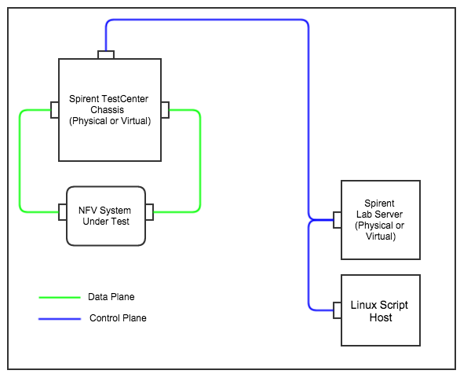

# RFC2544 Throughput Test

## Script name
testcenter-rfc2544-throughput.py

## Topology
Classic east-west, two port topology.



## Test Setup
The test is designed to be run with a lab server. The lab server, the Spirent TestCenter software on the
script host, and the Spirent chassis must all be running the same version of TestCenter software, e.g. 4.56.

The lab server, the TestCenter chassis, and a license server must be up and running prior to the execution
of the test script. 

## Usage
```
usage: testcenter-rfc2544-throughput.py [-h] --lab_server_addr LAB_SERVER_ADDR
                                        --license_server_addr
                                        LICENSE_SERVER_ADDR
                                        --east_chassis_addr EAST_CHASSIS_ADDR
                                        --east_slot_num EAST_SLOT_NUM
                                        --east_port_num EAST_PORT_NUM
                                        --west_chassis_addr WEST_CHASSIS_ADDR
                                        --west_slot_num WEST_SLOT_NUM
                                        --west_port_num WEST_PORT_NUM
                                        [--test_session_name TEST_SESSION_NAME]
                                        [--results_dir RESULTS_DIR]
                                        [--csv_results_file_prefix CSV_RESULTS_FILE_PREFIX]
                                        [--num_trials NUM_TRIALS]
                                        [--trial_duration_sec TRIAL_DURATION_SEC]
                                        [--traffic_pattern {BACKBONE,MESH,PAIR}]
                                        [--search_mode {COMBO,STEP,BINARY}]
                                        [--learning_mode {AUTO,L2_LEARNING,L3_LEARNING,NONE}]
                                        [--rate_lower_limit_pct RATE_LOWER_LIMIT_PCT]
                                        [--rate_upper_limit_pct RATE_UPPER_LIMIT_PCT]
                                        [--rate_initial_pct RATE_INITIAL_PCT]
                                        [--rate_step_pct RATE_STEP_PCT]
                                        [--resolution_pct RESOLUTION_PCT]
                                        [--frame_size_list FRAME_SIZE_LIST]
                                        [--acceptable_frame_loss_pct ACCEPTABLE_FRAME_LOSS_PCT]
                                        [--east_intf_addr EAST_INTF_ADDR]
                                        [--east_intf_gateway_addr EAST_INTF_GATEWAY_ADDR]
                                        [--west_intf_addr WEST_INTF_ADDR]
                                        [--west_intf_gateway_addr WEST_INTF_GATEWAY_ADDR]
                                        [-v]

optional arguments:
  -h, --help            show this help message and exit
  -v, --verbose         More output during operation when present

required named arguments:
  --lab_server_addr LAB_SERVER_ADDR
                        The IP address of the Spirent Lab Server
  --license_server_addr LICENSE_SERVER_ADDR
                        The IP address of the Spirent License Server
  --east_chassis_addr EAST_CHASSIS_ADDR
                        The TestCenter chassis IP address to use for the east
                        test port
  --east_slot_num EAST_SLOT_NUM
                        The TestCenter slot number to use for the east test
                        port
  --east_port_num EAST_PORT_NUM
                        The TestCenter port number to use for the east test
                        port
  --west_chassis_addr WEST_CHASSIS_ADDR
                        The TestCenter chassis IP address to use for the west
                        test port
  --west_slot_num WEST_SLOT_NUM
                        The TestCenter slot number to use for the west test
                        port
  --west_port_num WEST_PORT_NUM
                        The TestCenter port number to use for the west test
                        port

optional named arguments:
  --test_session_name TEST_SESSION_NAME
                        The friendly name to identify the Spirent Lab Server
                        test session
  --results_dir RESULTS_DIR
                        The directory to copy results to
  --csv_results_file_prefix CSV_RESULTS_FILE_PREFIX
                        The prefix for the CSV results files
  --num_trials NUM_TRIALS
                        The number of trials to execute during the test
  --trial_duration_sec TRIAL_DURATION_SEC
                        The duration of each trial executed during the test
  --traffic_pattern {BACKBONE,MESH,PAIR}
                        The traffic pattern between endpoints
  --search_mode {COMBO,STEP,BINARY}
                        The search mode used to find the throughput rate
  --learning_mode {AUTO,L2_LEARNING,L3_LEARNING,NONE}
                        The learning mode used during the test, default =
                        'NONE'
  --rate_lower_limit_pct RATE_LOWER_LIMIT_PCT
                        The minimum percent line rate that will be used during
                        the test
  --rate_upper_limit_pct RATE_UPPER_LIMIT_PCT
                        The maximum percent line rate that will be used during
                        the test
  --rate_initial_pct RATE_INITIAL_PCT
                        If Search Mode is BINARY, the percent line rate that
                        will be used at the start of the test
  --rate_step_pct RATE_STEP_PCT
                        If SearchMode is STEP, the percent load increase per
                        step
  --resolution_pct RESOLUTION_PCT
                        The minimum percentage of load adjustment between
                        iterations
  --frame_size_list FRAME_SIZE_LIST
                        A comma-delimited list of frame sizes
  --acceptable_frame_loss_pct ACCEPTABLE_FRAME_LOSS_PCT
                        The maximum acceptable frame loss percent in any
                        iteration
  --east_intf_addr EAST_INTF_ADDR
                        The address to assign to the first emulated device
                        interface on the first east port
  --east_intf_gateway_addr EAST_INTF_GATEWAY_ADDR
                        The gateway address to assign to the first emulated
                        device interface on the first east port
  --west_intf_addr WEST_INTF_ADDR
                        The address to assign to the first emulated device
                        interface on the first west port
  --west_intf_gateway_addr WEST_INTF_GATEWAY_ADDR
                        The gateway address to assign to the first emulated
                        device interface on the first west port
```
